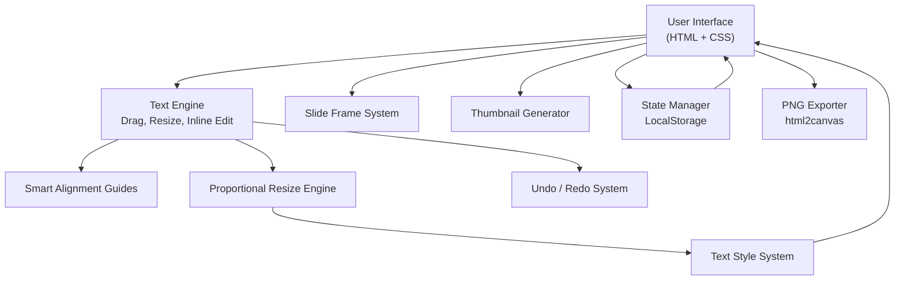

# 🎨 Slide Designer – Drag, Resize, Style & Export

A complete web-based slide/card editor built using **vanilla JavaScript**, with smart snapping, proportional resizing, inline editing, persistence, and PNG export.

---

## ✨ Features

### ✔️ Drag & Move Text
- Smooth drag inside slide
- Snap to edges, centers & other elements
- Auto alignment guides

### ✔️ Smart Alignment Guides
- Vertical & horizontal guides
- Snaps when near matching positions
- Helps maintain perfect symmetry

### ✔️ Proportional Resize
- Resize using bottom–right corner
- Text resizes proportionally
- Prevents distortion

### ✔️ Inline Text Editing
- Double-click to edit text directly
- Auto-expands height
- Updates sidebar editor instantly
# Presentation Builder Features

##  Full Styling Panel

- Font family
- Font color
- Font size
- Line height
- Alignment (left → center → right)
- Style (Regular / Bold / Italic)

## ✓ Frame-Based Slide Templates

- Each slide has a `<div class="slide-frame">`
- No broken image icon
- Easy to swap backgrounds

## ✓ Thumbnail Navigation

- Real-time miniature previews
- Updates automatically
- Click to jump to slide

## ✓ Undo / Redo System

- Ctrl + Z and Ctrl + Shift + Z
- Buttons included
- Up to 50 history states

## ✓ Auto-Persistence via LocalStorage

- First load → shows default template
- After editing → reload keeps exact state
- No data loss on refresh

## ✓ Export as PNG

- Uses html2canvas
- Downloads each slide individually
- Names based on project title
----
# Architecture Overview

---
## Project Structure
```
/
├── index.html
├── style.css
├── script.js
├── /assets
│     ├── 1.jpg
│     ├── 2.jpg
│     ├── 3.jpg
└── README.md
```

----
## Slide Structure
### Each slide uses this structure:

```bash
<div class="swiper-slide">
    <div class="image-container">

        <!-- Frame Background -->
        <div class="slide-frame">
            
        </div>

        <!-- Editable Texts -->
        <div class="text-layer">
            <div class="text-element" data-text-id="0">
                Your Text Here
            </div>
        </div>

    </div>
</div>
```
---
### Persistence System
#### First Time Load
 - Default frames and texts appear.
#### After Editing
- Saves automatically using:
```
    localStorage.setItem("celebrare_project_state", JSON.stringify(state));
    
```
#### On Refresh
- Loads instantly:
```
const saved = localStorage.getItem("celebrare_project_state");
if (saved) restoreState(saved);

```

---
# 🎛️ Editor Controls

## Inline Editor (Right Panel)

- Text content
- Font family
- Style (bold/italic)
- Alignment
- Line height
- Font size
- Color picker

## Click + Drag

- Move text
- Resize from corner

## Keyboard Shortcuts

| Action | Shortcut |
|--------|----------|
| Undo | Ctrl + Z |
| Redo | Ctrl + Shift + Z / Ctrl + Y |
| Delete Element | Delete key |

---

# 🖼️ Thumbnails

- Auto-generated for every slide
- Live updated
- Click to navigate

JS uses:
```js
updateThumbnailsPreview();
```

# 📊 Exporting Slides

Click **Download** ⬇️:

- Temporarily hides UI
- Captures each slide with html2canvas
- Downloads PNG files
- Restores editor afterward

Example exported files:
```
My_Project-slide-1.png
My_Project-slide-2.png
My_Project-slide-3.png
```

---
# How to Add a New Slide
#### Just paste this:
```
<div class="swiper-slide">
    <div class="image-container">

        <div class="slide-frame">
            
        </div>

        <div class="text-layer">
            <div class="text-element" data-text-id="X">
                New text
            </div>
        </div>

    </div>
</div>
```
#### The system will automatically:
- Make it draggable
- Add resizing
- Add inline editing
- Add thumbnail preview
- Save automatically

# ❗ Troubleshooting

## ✓ Frame image not visible

Make sure you used correct structure:
```html
<div class="slide-frame"></div>
```

---
##  Broken small icon appearing

This happens when `` exists.

Your new system **removes all empty src** → FIXED.

---

##  Text not saving

Check `saveState()` runs on input/change events.

---

#  License

Free for personal and commercial use.

---

# 👤 Author

**Roshan Kumar Ram**  
NIT Rourkela

